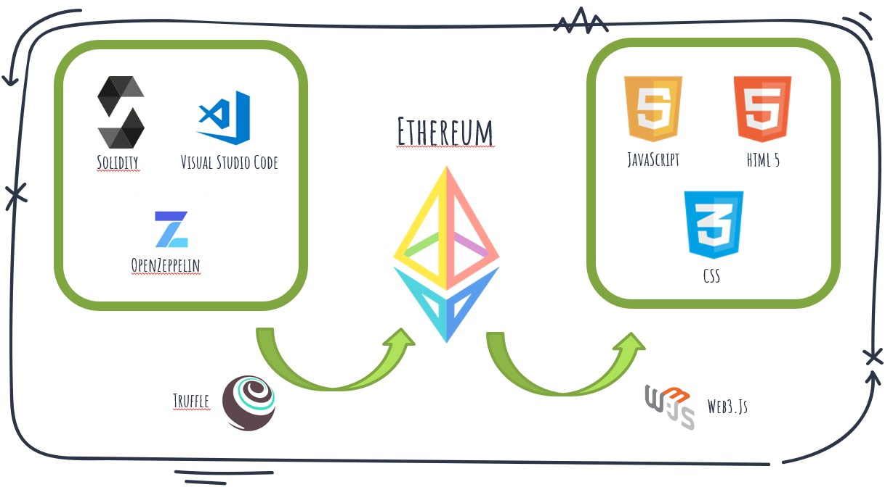

# Crypto Car  #
Il progetto propone una soluzione basata su blockchain etherum, per la compravendita di auto.
- Ad ogni auto venduta è associato un NFT che contiene tutte le informazioni sul veicolo(Precendenti proprietari e storico tagliandi).
- Viene inoltre gestita una differenziazione basata su ruoli tra venditore e meccanici per la gestione dei tagliandi.
- Ogni utente in blockchain può liberamente consultare lo stato di ogni veicolo.
- Il proprietario di un veicolo può effettuare il trasferimento di proprietà in completa autonomia.

## Info ##
Il progetto si compone di due SmartContract Solidity integrati con OpenZeppelin per la compliance agli standard ERC-721.

- ### CarLedger ###

   Il contratto che emula le funzioni del PRA ERC-721 compliant. 

- ### CryptoCar ###

    Contratto che rappresenta una concessionaria con offcina.

## Esecuzione ##

La cartella *src* contiene l'applicativo web.

Per il caricamento on chain è stato utilizzato il framework truffle, nella fase di migrate viene popolato con il file *cars.json*. 

